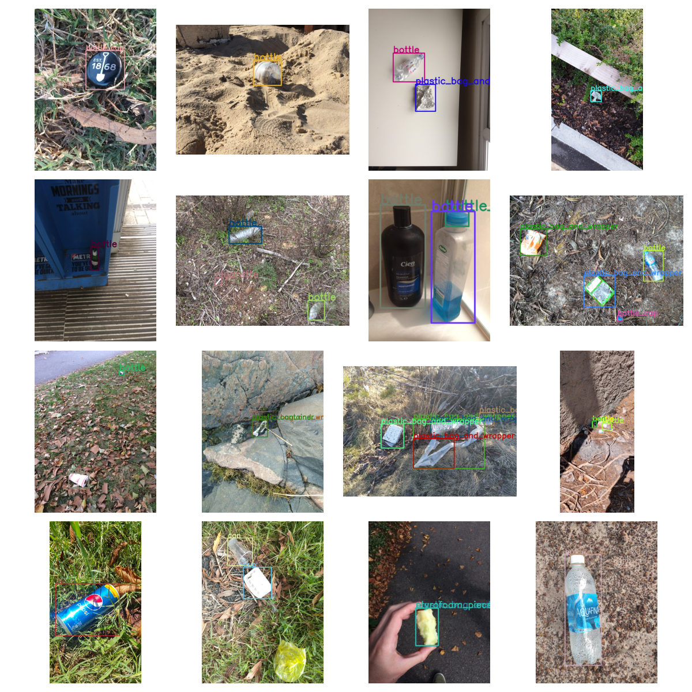

# Waste Detection

> detects many kinds of wastes/trashes in the wild



## Getting Started

### Prerequisites
1. **Python Environment**: Python 3.12 or higher
2. **Virtual Environment** (optional but recommended)
3. **Install Requirements**:
   ```bash
   pip install notebook

   # with CUDA, if possible: https://pytorch.org/get-started/locally/
   pip install torch torchvision torchaudio --index-url https://download.pytorch.org/whl/cu124
   pip install ultralytics opencv-python numpy
   ```

### Running the Notebook

For model training and detailed workflows, use the provided notebook:

1. **Start Jupyter**:  
   ```bash
   jupyter notebook
   ```

2. **Run the Notebook**:  
   Open and run cells in `waste-detection.ipynb`.

### Running the Script

Detect trash/waste using a webcam, image, or video file with a pretrained model.

Run the script:  
```bash
python waste_detection.py --model-path <path_to_model>.pt --input <source> --conf 0.5
```

### Arguments:
- `--model-path`: Path to the YOLO `.pt` model.  
- `--input`: Webcam (`0`), image, or video file path.  
- `--conf`: Confidence threshold (default: `0.5`). Lower values detect more objects.

### Example:
```bash
python waste_detection.py --model-path best.pt --input 0 --conf 0.6
```
